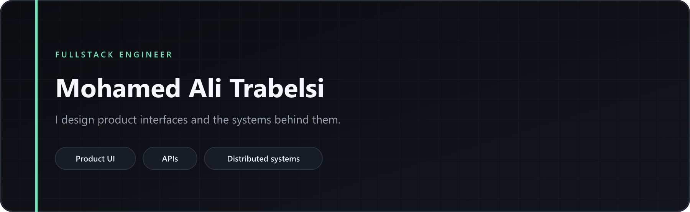
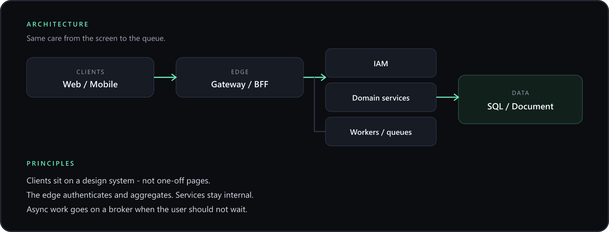

  

  Hierarchy, spacing, motion, empty and error states — 
  the same standard as gateway → service → data → events.

  
  
  
  
  
  
  
  
  
  
  

---

  

---

<table>
  <tr>
    <td width="50%" valign="top">

### Interface

UI is a **system**: tokens, composition, states — not a pile of screens.

- **Design system** — color, type, spacing, shared components across web and mobile
- **Composition** — small presentational pieces assembled into features
- **Separation** — data and side effects stay out of visual components
- **States** — loading, empty, error, success are designed, not leftover
- **Motion** — feedback and hierarchy, never decoration
- **Ship bar** — contrast, focus, tap targets, responsive layout

    </td>
    <td width="50%" valign="top">

### Platform

The backend should stay **readable** after the product ships.

- **Layers** — controller → application → domain → persistence
- **Gateway** — one entry for clients; services stay internal
- **IAM** — identity is its own context, not mixed into every feature
- **Adapters** — domain rules do not talk to the database driver
- **Events** — queues for async and cross-service work
- **Contracts** — REST, validation, consistent errors, E2E on real environments

    </td>
  </tr>
</table>

---

### Patterns I actually use

| Layer | What I reach for |
|:---|:---|
| Product UI | Design system · composition · container / presentational |
| Client–server | BFF or API gateway in front of services |
| Decomposition | Microservices with clear bounded contexts |
| Identity | Dedicated IAM · token-based access |
| Persistence | Repository · migrations · SQL + document where each fits |
| Coupling | Message queue instead of synchronous chains |
| Quality | Playwright against recette / dev — not only local happy paths |

I do not label work DDD, hexagonal, or CQRS unless that was the real architecture.

---

  Looking for fullstack seats where <strong>design and architecture are the same job</strong>. 
  <a href="https://github.com/MohamedAliTrabelsiSE">github.com/MohamedAliTrabelsiSE</a>

